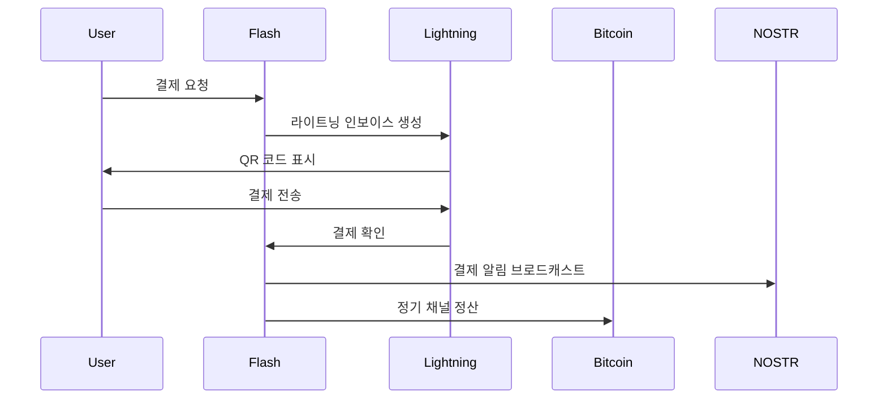

# Flash 프로토콜 스택

Flash는 검증된 여러 오픈 프로토콜 위에 구축되어 안전하고 빠르며 탈중앙화된 금융 서비스를 제공합니다. 이러한 프로토콜이 어떻게 함께 작동하는지 이해하면 Flash가 제공하는 혁신을 더 잘 이해할 수 있습니다.

## 🏛️ 프로토콜 계층

### 계층적 아키텍처
```
┌─────────────────────────────┐
│      애플리케이션 계층       │ ← Flash 앱 & 서비스
├─────────────────────────────┤
│       서비스 계층           │ ← API, 통합, SDK
├─────────────────────────────┤
│      프로토콜 계층          │ ← NOSTR, eCash
├─────────────────────────────┤
│     라이트닝 네트워크       │ ← 즉시 결제
├─────────────────────────────┤
│      비트코인 블록체인      │ ← 기반 보안
└─────────────────────────────┘
```

## ⚡ 핵심 프로토콜

### 1. 비트코인 프로토콜
블록체인 기술의 기초:

```javascript
// 비트코인 거래 구조
const bitcoinTransaction = {
  version: 2,
  inputs: [{
    previousTx: "txid...",
    outputIndex: 0,
    scriptSig: "signature...",
    sequence: 0xffffffff
  }],
  outputs: [{
    value: 100000, // 사토시
    scriptPubKey: "OP_DUP OP_HASH160..."
  }],
  lockTime: 0
};
```

**Flash에서의 역할:**
- 최종 정산 계층
- 가치 저장
- 보안 앵커
- 신뢰 기반

### 2. 라이트닝 네트워크 프로토콜
결제 채널을 통한 즉시 거래:

```python
# 라이트닝 결제 흐름
def lightning_payment(amount, recipient):
    # 1. 경로 찾기
    route = find_route(sender, recipient, amount)
    
    # 2. HTLC 생성
    htlc = create_htlc(
        amount=amount,
        payment_hash=generate_hash(),
        timeout=3600
    )
    
    # 3. 결제 전송
    for hop in route:
        hop.forward_payment(htlc)
    
    # 4. 사전 이미지 공개
    return reveal_preimage(payment_hash)
```

**주요 기능:**
- 밀리초 단위 결제
- 극히 낮은 수수료
- 무제한 확장성
- 개인정보 보호 라우팅

### 3. NOSTR 프로토콜
탈중앙화 통신과 신원:

```typescript
// NOSTR 이벤트 프로토콜
interface NostrEvent {
  id: string;      // 이벤트 해시
  pubkey: string;  // 발신자 공개 키
  created_at: number;
  kind: number;    // 이벤트 유형
  tags: string[][]; // 메타데이터
  content: string; // 메시지 내용
  sig: string;     // 서명
}

// 이벤트 생성
function createEvent(content: string, kind: number): NostrEvent {
  const event = {
    pubkey: getPublicKey(),
    created_at: Math.floor(Date.now() / 1000),
    kind,
    tags: [],
    content
  };
  
  event.id = calculateEventId(event);
  event.sig = signEvent(event);
  
  return event;
}
```

**용도:**
- 보안 메시징
- 소셜 기능
- 탈중앙화 신원
- 이벤트 브로드캐스팅

### 4. eCash 프로토콜
개인정보 보호 디지털 현금:

```rust
// eCash 토큰 구조
struct ECashToken {
    amount: u64,
    blinded_signature: BlindedSignature,
    mint_pubkey: PublicKey,
    serial_number: Hash,
}

// 블라인드 서명 프로세스
fn mint_token(amount: u64, blinded_message: &[u8]) -> ECashToken {
    let signature = blind_sign(blinded_message, mint_private_key);
    
    ECashToken {
        amount,
        blinded_signature: signature,
        mint_pubkey: get_mint_pubkey(),
        serial_number: generate_serial(),
    }
}
```

**이점:**
- 완전한 개인정보 보호
- 오프라인 거래
- 즉각적인 전송
- 연결 불가능성

## 🔄 프로토콜 상호작용

### 통합 예시
Flash가 프로토콜을 결합하는 방법:



### 크로스 프로토콜 기능
1. **Zaps**: 라이트닝 + NOSTR
2. **채널 백업**: 비트코인 + NOSTR
3. **프라이빗 결제**: 라이트닝 + eCash
4. **소셜 결제**: 모든 프로토콜 결합

## 🛡️ 보안 모델

### 다층 보안
각 프로토콜은 보안을 추가합니다:

```yaml
보안 계층:
  비트코인:
    - 작업 증명
    - 암호화 서명
    - 분산 합의
    
  라이트닝:
    - HTLC 시간 잠금
    - 벌금 거래
    - 양파 라우팅
    
  NOSTR:
    - 공개 키 암호화
    - 메시지 서명
    - 릴레이 중복성
    
  eCash:
    - 블라인드 서명
    - 이중 지출 방지
    - 민트 감사
```

### 신뢰 최소화
```javascript
// 신뢰 요구 사항 비교
const trustModels = {
  traditional: {
    bank: "완전 신뢰",
    payment: "중개자 신뢰",
    privacy: "없음"
  },
  
  flash: {
    bitcoin: "무신뢰",
    lightning: "최소 신뢰",
    nostr: "무신뢰",
    ecash: "민트 신뢰"
  }
};
```

## 📊 성능 특성

### 프로토콜 비교
| 측면 | 비트코인 | 라이트닝 | NOSTR | eCash |
|------|----------|----------|--------|--------|
| 속도 | 10분 | <1초 | 즉시 | 즉시 |
| 수수료 | 중간 | 극히 낮음 | 없음 | 없음 |
| 개인정보 | 낮음 | 중간 | 높음 | 매우 높음 |
| 확장성 | 제한적 | 높음 | 매우 높음 | 매우 높음 |
| 복잡성 | 낮음 | 높음 | 낮음 | 중간 |

## 🔧 구현 세부사항

### 프로토콜 버전
Flash가 사용하는 사양:

```json
{
  "protocols": {
    "bitcoin": {
      "version": "23.0",
      "network": "mainnet",
      "features": ["segwit", "taproot"]
    },
    "lightning": {
      "implementation": "LND",
      "version": "0.16.0",
      "features": ["amp", "mpp", "keysend"]
    },
    "nostr": {
      "nips": [1, 4, 5, 9, 11, 57],
      "relays": ["wss://relay.flash.app"]
    },
    "ecash": {
      "protocol": "cashu",
      "version": "0.4",
      "mints": ["mint.flash.app"]
    }
  }
}
```

### 상호 운용성
프로토콜이 함께 작동하는 방법:

```typescript
class FlashProtocolStack {
  async sendPayment(recipient: string, amount: number, message?: string) {
    // 1. 수신자 확인 (NOSTR)
    const recipientKey = await this.nostr.resolveRecipient(recipient);
    
    // 2. 결제 방법 선택
    if (amount < 1000) {
      // 소액: eCash 사용
      return this.ecash.send(recipientKey, amount);
    } else if (amount < 1000000) {
      // 중간: 라이트닝 사용
      const invoice = await this.lightning.createInvoice(amount);
      
      // 3. 알림 전송 (NOSTR)
      if (message) {
        await this.nostr.sendEncrypted(recipientKey, message);
      }
      
      return invoice;
    } else {
      // 대액: 온체인 비트코인
      return this.bitcoin.createTransaction(recipientKey, amount);
    }
  }
}
```

## 🚀 미래 프로토콜

### 연구 개발 중
1. **Taproot Assets**: 비트코인의 토큰
2. **Ark**: 새로운 L2 프로토콜
3. **Fedimint**: 연합 eCash
4. **Liquidity Ads**: 자동화된 채널 시장

### 프로토콜 개선
```yaml
예정된 업그레이드:
  비트코인:
    - Covenants
    - Cross-input signature aggregation
    
  라이트닝:
    - Eltoo
    - Channel factories
    - Splicing
    
  NOSTR:
    - 개인 그룹
    - 음성/비디오 통화
    - 분산 저장소
```

## 🎓 더 알아보기

### 프로토콜별 리소스
- **비트코인**: [bitcoin.org/developer](https://bitcoin.org/developer)
- **라이트닝**: [docs.lightning.engineering](https://docs.lightning.engineering)
- **NOSTR**: [nostr.com](https://nostr.com)
- **eCash**: [cashu.space](https://cashu.space)

### Flash 구현
- [GitHub 저장소](https://github.com/flash)
- [프로토콜 문서](/ko/development)
- [API 참조](https://api.flash.app/docs)

<div class="protocol-cta">
  <h2>프로토콜의 힘 활용하기</h2>
  <p>Flash로 탈중앙화 금융의 미래를 경험하세요</p>
  <a href="/ko/get-started" class="btn-primary">지금 시작하기</a>
</div>

<style>
  pre {
    background: var(--code-bg, #1f2937);
    color: var(--code-color, #e5e7eb);
    padding: 1rem;
    border-radius: 0.5rem;
    overflow-x: auto;
    margin: 1rem 0;
  }
  
  code {
    background: var(--inline-code-bg, #f3f4f6);
    color: var(--inline-code-color, #1f2937);
    padding: 0.2rem 0.4rem;
    border-radius: 0.25rem;
    font-size: 0.875em;
  }
  
  table {
    width: 100%;
    border-collapse: collapse;
    margin: 1rem 0;
  }
  
  th, td {
    padding: 0.75rem;
    text-align: left;
    border-bottom: 1px solid var(--border-color, #e5e7eb);
  }
  
  th {
    font-weight: 600;
    background: var(--bg-secondary, #f9fafb);
  }
  
  .protocol-cta {
    background: linear-gradient(135deg, #4f46e5 0%, #7c3aed 100%);
    color: white;
    padding: 3rem;
    border-radius: 1rem;
    text-align: center;
    margin-top: 3rem;
  }
  
  .protocol-cta h2 {
    color: white;
    margin: 0 0 0.5rem 0;
  }
  
  .protocol-cta p {
    margin: 0 0 2rem 0;
    font-size: 1.1rem;
  }
  
  .btn-primary {
    display: inline-block;
    background-color: white;
    color: #4f46e5;
    padding: 0.75rem 1.5rem;
    border-radius: 0.5rem;
    text-decoration: none;
    font-weight: 500;
    transition: all 0.2s;
  }
  
  .btn-primary:hover {
    transform: translateY(-2px);
    box-shadow: 0 4px 12px rgba(0, 0, 0, 0.2);
  }
  
  :global(.dark) code {
    background: #374151;
    color: #f3f4f6;
  }
  
  :global(.dark) th {
    background: #1f2937;
  }
  
  :global(.dark) th,
  :global(.dark) td {
    border-color: #374151;
  }
</style>