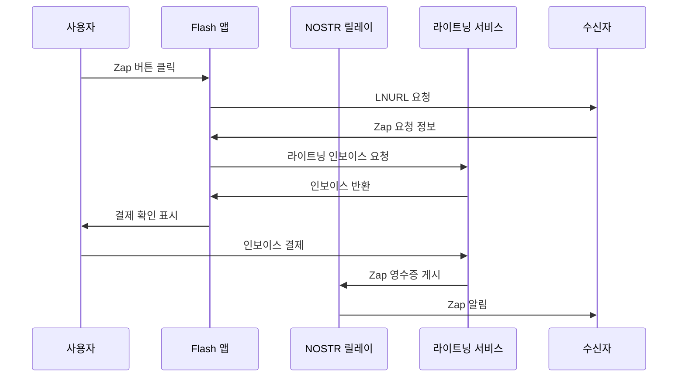

# Zaps

Zaps는 NOSTR 프로토콜과 라이트닝 네트워크를 결합하여 소셜 미디어에서 즉각적인 비트코인 팁을 가능하게 하는 혁신적인 기능입니다. Flash는 Zaps를 완벽하게 지원하여 콘텐츠 창작자에게 보상하고 커뮤니티와 상호작용하는 원활한 방법을 제공합니다.

## ⚡ Zap이란?

Zap은 NOSTR 이벤트에 연결된 라이트닝 결제입니다. 단순한 "좋아요"를 넘어, Zap은 사용자가 감사를 표현하는 동시에 실제 가치를 전송할 수 있게 합니다.

### 기존 팁과의 차이점
```javascript
// 전통적인 팁
traditionalTip = {
  platform: "중앙화",
  fees: "15-30%",
  settlement: "1-7일",
  minimums: "$1-5",
  restrictions: "지역/규정"
};

// Zaps
zap = {
  platform: "탈중앙화",
  fees: "<1%",
  settlement: "즉시",
  minimums: "1 사토시",
  restrictions: "없음"
};
```

## 🔧 Zaps 작동 방식

### Zap 흐름


### 기술적 구현
```typescript
// Zap 생성 프로세스
async function createZap(event: NostrEvent, amount: number, comment?: string) {
  // 1. Zap 요청 이벤트 생성
  const zapRequest = {
    kind: 9734,
    content: comment || "",
    tags: [
      ["p", event.pubkey],
      ["e", event.id],
      ["amount", amount.toString()],
      ["relays", ...preferredRelays]
    ],
    created_at: Math.floor(Date.now() / 1000)
  };
  
  // 2. 이벤트 서명
  const signedRequest = await signEvent(zapRequest);
  
  // 3. LNURL 서비스에서 인보이스 가져오기
  const invoice = await fetchInvoice(
    recipientLNURL,
    amount,
    signedRequest
  );
  
  // 4. 결제 처리
  await payInvoice(invoice);
  
  // 5. Zap 영수증이 릴레이에 나타날 때까지 대기
  return waitForZapReceipt(event.id);
}
```

## 💡 Flash의 Zap 기능

### 1. 원클릭 Zaps
```javascript
// Flash의 간소화된 Zap 인터페이스
const flashZap = new FlashZap({
  defaultAmount: 100, // 사토시
  quickAmounts: [21, 69, 420, 1000, 5000],
  showComment: true,
  animateZap: true
});

// 원클릭 Zap
flashZap.send(eventId, 100);
```

### 2. Zap 분할
여러 수신자에게 Zap 분배:

```typescript
interface ZapSplit {
  recipients: Array<{
    pubkey: string;
    percentage: number;
    reason?: string;
  }>;
  totalAmount: number;
}

// 사용 예시
await flash.zapSplit({
  recipients: [
    { pubkey: "author", percentage: 70 },
    { pubkey: "illustrator", percentage: 20 },
    { pubkey: "editor", percentage: 10 }
  ],
  totalAmount: 10000
});
```

### 3. 자동 Zaps
```javascript
// 콘텐츠 품질에 따른 자동 Zap
const autoZapConfig = {
  enabled: true,
  rules: [
    {
      trigger: "post_length",
      condition: "> 500 chars",
      amount: 100
    },
    {
      trigger: "media_included",
      condition: true,
      amount: 200
    },
    {
      trigger: "keyword_match",
      keywords: ["bitcoin", "lightning"],
      amount: 50
    }
  ],
  dailyLimit: 10000
};
```

## 🎯 Zap 유형

### 1. 공개 Zaps
모두가 볼 수 있는 표준 Zaps:

```json
{
  "kind": 9735,
  "content": "",
  "tags": [
    ["p", "수신자_공개키"],
    ["e", "zapped_이벤트_id"],
    ["bolt11", "라이트닝_인보이스"],
    ["description", "{zap_요청_json}"],
    ["amount", "1000"]
  ]
}
```

### 2. 비공개 Zaps
익명 또는 비공개 Zaps:

```javascript
// 비공개 Zap 구현
async function privateZap(eventId: string, amount: number) {
  const anonKey = generateRandomKey();
  
  const zapRequest = await createZapRequest({
    eventId,
    amount,
    pubkey: anonKey.public,
    private: true
  });
  
  // 익명 키로 서명
  return signWithKey(zapRequest, anonKey.private);
}
```

### 3. 예약 Zaps
미래 실행을 위한 예약:

```typescript
interface ScheduledZap {
  eventId: string;
  amount: number;
  executeAt: Date;
  condition?: {
    type: 'time' | 'event' | 'milestone';
    value: any;
  };
}

// 예시: 목표 달성 시 Zap
flash.scheduleZap({
  eventId: "fundraiser_event",
  amount: 10000,
  condition: {
    type: 'milestone',
    value: { goal: 1000000, metric: 'total_zaps' }
  }
});
```

## 📊 Zap 분석

### 메트릭 추적
```javascript
// Flash Zap 분석
const zapAnalytics = await flash.getZapStats({
  period: '30d',
  groupBy: 'day'
});

// 반환 데이터
{
  sent: {
    total: 150000,      // 사토시
    count: 143,
    average: 1049,
    topRecipients: [...],
    categories: {...}
  },
  received: {
    total: 89000,
    count: 67,
    average: 1328,
    topSenders: [...],
    trends: {...}
  }
}
```

### Zap 리더보드
```typescript
// 상위 Zapped 콘텐츠
const topZapped = await flash.getTopZapped({
  timeframe: 'week',
  limit: 20,
  minZaps: 5
});

// UI에 표시
topZapped.forEach(post => {
  console.log(`${post.content.substring(0, 50)}...`);
  console.log(`Total: ${post.zapTotal} sats from ${post.zapCount} zaps`);
});
```

## 💰 경제적 영향

### 창작자 경제
```yaml
전통적인 모델:
  - 플랫폼 수수료: 30%
  - 결제 처리: 3-5%
  - 최소 지급액: $100
  - 지급 지연: 30-60일

Zap 모델:
  - 플랫폼 수수료: 0%
  - 결제 처리: <1%
  - 최소 지급액: 1 sat
  - 지급 지연: 즉시
```

### 가치 흐름
```javascript
// Zap 가치 분포
const valueFlow = {
  microZaps: {      // 1-100 sats
    volume: "45%",
    useCase: "감사 표현"
  },
  smallZaps: {      // 100-1000 sats
    volume: "35%",
    useCase: "품질 콘텐츠 보상"
  },
  mediumZaps: {     // 1000-10000 sats
    volume: "15%",
    useCase: "상당한 기여"
  },
  largeZaps: {      // 10000+ sats
    volume: "5%",
    useCase: "주요 지원/후원"
  }
};
```

## 🛡️ 보안 고려사항

### Zap 검증
```typescript
// Zap 영수증 검증
function verifyZapReceipt(receipt: NostrEvent): boolean {
  // 1. 이벤트 서명 확인
  if (!verifySignature(receipt)) return false;
  
  // 2. 설명 태그 확인
  const description = getTag(receipt, 'description');
  const zapRequest = JSON.parse(description);
  
  // 3. 금액 일치 확인
  const bolt11 = getTag(receipt, 'bolt11');
  const invoice = decodeBolt11(bolt11);
  const requestAmount = getTag(zapRequest, 'amount');
  
  if (invoice.amount !== requestAmount) return false;
  
  // 4. 수신자 확인
  const pTag = getTag(zapRequest, 'p');
  return pTag === expectedRecipient;
}
```

### 스팸 방지
```javascript
// Zap 스팸 필터
const antiSpamRules = {
  minAmount: 10,              // 최소 10 sats
  maxFrequency: 100,          // 시간당 최대 100 zaps
  requireProfile: true,       // 프로필 필요
  blacklist: [...],          // 차단된 공개키
  suspiciousPatterns: [...]   // 의심스러운 행동
};
```

## 🚀 고급 Zap 기능

### 1. Zap 목표
```javascript
// 크라우드펀딩 스타일 Zap 목표
const zapGoal = {
  target: 1000000,    // 사토시
  deadline: new Date('2024-12-31'),
  description: "새로운 기능 개발",
  rewards: [
    { amount: 10000, reward: "Early access" },
    { amount: 50000, reward: "Beta tester" },
    { amount: 100000, reward: "Lifetime pro" }
  ]
};

// 진행 상황 추적
const progress = await flash.trackZapGoal(zapGoal);
```

### 2. Zap 전달
```typescript
// 조건부 Zap 전달
interface ZapForward {
  trigger: 'threshold' | 'percentage' | 'time';
  condition: any;
  recipients: Array<{
    pubkey: string;
    amount: number | string; // 고정 또는 백분율
  }>;
}

// 예: 1000 sats 도달 시 팀에 전달
const forwardConfig: ZapForward = {
  trigger: 'threshold',
  condition: { amount: 1000 },
  recipients: [
    { pubkey: 'team_member_1', amount: '30%' },
    { pubkey: 'team_member_2', amount: '30%' },
    { pubkey: 'charity', amount: '40%' }
  ]
};
```

### 3. Zap 뱃지
```javascript
// 성취 기반 뱃지
const zapBadges = {
  'zap_rookie': { received: 100, icon: '⚡' },
  'zap_hero': { received: 10000, icon: '🦸' },
  'zap_legend': { received: 100000, icon: '👑' },
  'generous_zapper': { sent: 50000, icon: '💝' },
  'consistent_zapper': { dailyStreak: 30, icon: '🔥' }
};

// 뱃지 확인 및 수여
async function checkBadges(userPubkey: string) {
  const stats = await getZapStats(userPubkey);
  const earnedBadges = [];
  
  for (const [badge, criteria] of Object.entries(zapBadges)) {
    if (meetsCriteria(stats, criteria)) {
      earnedBadges.push(badge);
    }
  }
  
  return earnedBadges;
}
```

## 🌟 Zaps의 미래

### 개발 중인 기능
1. **스마트 Zaps**: AI 기반 콘텐츠 평가
2. **Zap 스트림**: 지속적인 가치 전송
3. **크로스 플랫폼 Zaps**: 다른 프로토콜과 통합
4. **Zap DAOs**: 커뮤니티 자금 관리

### Flash의 혁신
```typescript
// 출시 예정: Flash Zap 혁신
interface UpcomingFeatures {
  zapStreaming: {
    description: "시간당 지속적인 zaps",
    useCase: "라이브 콘텐츠, 스트리밍"
  },
  
  conditionalZaps: {
    description: "이벤트 기반 zaps",
    useCase: "마일스톤, 성과"
  },
  
  zapPools: {
    description: "커뮤니티 자금 풀",
    useCase: "공동 프로젝트, 보상"
  },
  
  zapNFTs: {
    description: "수집 가능한 zap 영수증",
    useCase: "기념품, 증명"
  }
}
```

<div class="zap-cta">
  <h2>Zapping 시작하기!</h2>
  <p>Flash로 창작자를 지원하고 가치 있는 콘텐츠에 보상하세요</p>
  <div class="cta-buttons">
    <a href="/ko/guides/zaps" class="btn-primary">Zap 가이드</a>
    <a href="/ko/get-started" class="btn-secondary">Flash 다운로드</a>
  </div>
</div>

<style>
  pre {
    background: var(--code-bg, #1f2937);
    color: var(--code-color, #e5e7eb);
    padding: 1rem;
    border-radius: 0.5rem;
    overflow-x: auto;
    margin: 1rem 0;
  }
  
  code {
    background: var(--inline-code-bg, #f3f4f6);
    color: var(--inline-code-color, #1f2937);
    padding: 0.2rem 0.4rem;
    border-radius: 0.25rem;
    font-size: 0.875em;
  }
  
  .zap-cta {
    background: linear-gradient(135deg, #fbbf24 0%, #f59e0b 100%);
    color: #1f2937;
    padding: 3rem;
    border-radius: 1rem;
    text-align: center;
    margin-top: 3rem;
    position: relative;
    overflow: hidden;
  }
  
  .zap-cta::before {
    content: '⚡';
    position: absolute;
    font-size: 10rem;
    opacity: 0.1;
    top: -2rem;
    right: -2rem;
    transform: rotate(-15deg);
  }
  
  .zap-cta h2 {
    color: #1f2937;
    margin: 0 0 0.5rem 0;
    position: relative;
  }
  
  .zap-cta p {
    margin: 0 0 2rem 0;
    font-size: 1.1rem;
    position: relative;
  }
  
  .cta-buttons {
    display: flex;
    gap: 1rem;
    justify-content: center;
    flex-wrap: wrap;
    position: relative;
  }
  
  .btn-primary, .btn-secondary {
    display: inline-block;
    padding: 0.75rem 1.5rem;
    border-radius: 0.5rem;
    text-decoration: none;
    font-weight: 500;
    transition: all 0.2s;
  }
  
  .btn-primary {
    background-color: #1f2937;
    color: white;
  }
  
  .btn-secondary {
    background-color: transparent;
    color: #1f2937;
    border: 2px solid #1f2937;
  }
  
  .btn-primary:hover {
    background-color: #111827;
    transform: translateY(-2px);
    box-shadow: 0 4px 12px rgba(0, 0, 0, 0.2);
  }
  
  .btn-secondary:hover {
    background-color: rgba(31, 41, 55, 0.1);
  }
  
  :global(.dark) code {
    background: #374151;
    color: #f3f4f6;
  }
</style>